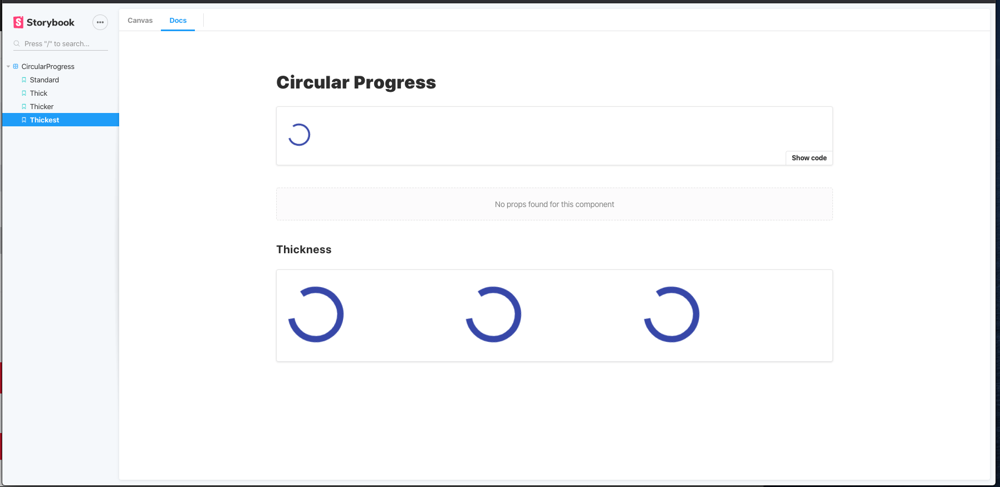
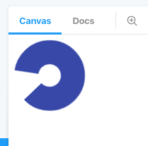

## Running Storybook Demo

* `yarn` to install dependencies
* `yarn start` to run the application on port 9050

## Issues Demo

* I am seeing issues when running stories with the same component multiple times using knobs inside of MDX/doc addon stories
* The CircularProgress is used as an example, but the props are copied throughout multiple stories instead of being individualized

* When things are viewed in the `CANVAS` tab styles are appropriately shown through the knobs

